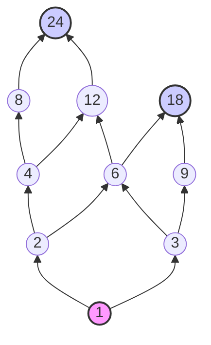

# Comprehensive Mathematical Solutions

This document contains detailed, step-by-step solutions for each of the 12 mathematics questions regarding sets, relations, functions, and Hasse diagrams.

---

## 1. Cartesian Product of Intersection
### **Question:**
If $A = \{1, 2, 3\}$, $B = \{3, 4, 5\}$ and $C = \{0, 2, 3\}$, find $(A \cap B) \times C$.

### **Step-by-Step Solution:**
1. **Find the intersection $(A \cap B)$**:
   The intersection of two sets contains only the elements that are common to both sets.
   $$A \cap B = \{1, 2, 3\} \cap \{3, 4, 5\} = \{3\}$$

2. **Find the Cartesian product $(A \cap B) \times C$**:
   The Cartesian product of two sets $X$ and $Y$, denoted $X \times Y$, is the set of all ordered pairs $(x, y)$ such that $x \in X$ and $y \in Y$.
   Here, $X = A \cap B = \{3\}$ and $Y = C = \{0, 2, 3\}$.
   $$(A \cap B) \times C = \{3\} \times \{0, 2, 3\} = \{(3, 0), (3, 2), (3, 3)\}$$

### **Answer:**
$$\mathbf{(A \cap B) \times C = \{(3, 0), (3, 2), (3, 3)\}}$$

---

## 2. Verification of Cartesian Product Distributivity
### **Question:**
If $A = \{1, 4\}$, $B = \{2, 3, 6\}$ (assuming the typo `3.6` is $6$) and $C = \{2, 3, 7\}$, verify that $A \times (B - C) = (A \times B) - (A \times C)$.

*(Note: We will provide verification for both cases: when $B = \{2, 3, 6\}$ and when $B = \{2, 3.6\}$).*

---

### **Case 1: Under the standard assumption $B = \{2, 3, 6\}$**

#### **Left-Hand Side (LHS): $A \times (B - C)$**
1. **Find the set difference $B - C$**:
   The set difference contains elements that belong to $B$ but not to $C$.
   $$B - C = \{2, 3, 6\} - \{2, 3, 7\} = \{6\}$$
2. **Find $A \times (B - C)$**:
   $$A \times (B - C) = \{1, 4\} \times \{6\} = \{(1, 6), (4, 6)\}$$

#### **Right-Hand Side (RHS): $(A \times B) - (A \times C)$**
1. **Find the Cartesian product $A \times B$**:
   $$A \times B = \{1, 4\} \times \{2, 3, 6\} = \{(1, 2), (1, 3), (1, 6), (4, 2), (4, 3), (4, 6)\}$$
2. **Find the Cartesian product $A \times C$**:
   $$A \times C = \{1, 4\} \times \{2, 3, 7\} = \{(1, 2), (1, 3), (1, 7), (4, 2), (4, 3), (4, 7)\}$$
3. **Calculate the difference $(A \times B) - (A \times C)$**:
   Subtract any pairs in $A \times C$ from $A \times B$:
   - $(1, 2)$ is in $A \times C$ $\rightarrow$ Remove
   - $(1, 3)$ is in $A \times C$ $\rightarrow$ Remove
   - $(1, 6)$ is NOT in $A \times C$ $\rightarrow$ Keep
   - $(4, 2)$ is in $A \times C$ $\rightarrow$ Remove
   - $(4, 3)$ is in $A \times C$ $\rightarrow$ Remove
   - $(4, 6)$ is NOT in $A \times C$ $\rightarrow$ Keep
   
   $$(A \times B) - (A \times C) = \{(1, 6), (4, 6)\}$$

#### **Conclusion:**
Since $\text{LHS} = \text{RHS} = \{(1, 6), (4, 6)\}$, the identity is **verified**.

---

### **Case 2: Under the literal assumption $B = \{2, 3.6\}$**

#### **Left-Hand Side (LHS): $A \times (B - C)$**
1. **Find the set difference $B - C$**:
   $$B - C = \{2, 3.6\} - \{2, 3, 7\} = \{3.6\}$$
2. **Find $A \times (B - C)$**:
   $$A \times (B - C) = \{1, 4\} \times \{3.6\} = \{(1, 3.6), (4, 3.6)\}$$

#### **Right-Hand Side (RHS): $(A \times B) - (A \times C)$**
1. **Find the Cartesian product $A \times B$**:
   $$A \times B = \{1, 4\} \times \{2, 3.6\} = \{(1, 2), (1, 3.6), (4, 2), (4, 3.6)\}$$
2. **Find the Cartesian product $A \times C$**:
   $$A \times C = \{1, 4\} \times \{2, 3, 7\} = \{(1, 2), (1, 3), (1, 7), (4, 2), (4, 3), (4, 7)\}$$
3. **Calculate the difference $(A \times B) - (A \times C)$**:
   - $(1, 2)$ and $(4, 2)$ are present in $A \times C$ $\rightarrow$ Remove
   - $(1, 3.6)$ and $(4, 3.6)$ are NOT present in $A \times C$ $\rightarrow$ Keep
   
   $$(A \times B) - (A \times C) = \{(1, 3.6), (4, 3.6)\}$$

#### **Conclusion:**
Since $\text{LHS} = \text{RHS} = \{(1, 3.6), (4, 3.6)\}$, the identity is **verified** in this case as well.

---

## 3. Venn Diagram/Set Theory Application (Students Study Choices)
### **Question:**
Out of 100 students in a class, 60 study Mathematics, 53 study Biology and 35 study both the subjects. How many students:
1. do not study any of these subjects,
2. study only Mathematics but not biology.

### **Step-by-Step Solution:**
Let:
- $U$ be the universal set representing all students in the class. Thus, $n(U) = 100$.
- $M$ be the set of students who study Mathematics. Thus, $n(M) = 60$.
- $B$ be the set of students who study Biology. Thus, $n(B) = 53$.
- $M \cap B$ be the set of students who study both subjects. Thus, $n(M \cap B) = 35$.

#### **Part (i): Students who do not study any of these subjects**
1. First, find the number of students who study **at least one** of these subjects, which is represented by the union $M \cup B$:
   $$n(M \cup B) = n(M) + n(B) - n(M \cap B)$$
   $$n(M \cup B) = 60 + 53 - 35 = 78$$
   So, $78$ students study either Mathematics, Biology, or both.

2. The number of students who study **neither** of these subjects is the complement of the union:
   $$n(M \cup B)' = n(U) - n(M \cup B)$$
   $$n(M \cup B)' = 100 - 78 = 22$$

#### **Part (ii): Students who study only Mathematics but not Biology**
This is represented by the set difference $M - B$, which represents students who are in $M$ but not in $B$.
$$n(\text{Only } M) = n(M) - n(M \cap B)$$
$$n(\text{Only } M) = 60 - 35 = 25$$

### **Answers:**
* **(i) Students studying neither subject:** $22$
* **(ii) Students studying only Mathematics:** $25$

---

## 4. Venn Diagram/Set Theory Application (Sports Choice)
### **Question:**
Out of 80 students in a class, 60 play football, 53 play hockey and 35 play both the games. How many students:
1. do not play any of these games,
2. play only hockey but not football.

### **Step-by-Step Solution:**
Let:
- $U$ be the universal set of all students in the class. Thus, $n(U) = 80$.
- $F$ be the set of students who play Football. Thus, $n(F) = 60$.
- $H$ be the set of students who play Hockey. Thus, $n(H) = 53$.
- $F \cap H$ be the set of students who play both games. Thus, $n(F \cap H) = 35$.

#### **Part (i): Students who do not play any of these games**
1. First, find the number of students who play **at least one** game, which is the union $F \cup H$:
   $$n(F \cup H) = n(F) + n(H) - n(F \cap H)$$
   $$n(F \cup H) = 60 + 53 - 35 = 78$$

2. The number of students who do not play **any** of these games is:
   $$n(F \cup H)' = n(U) - n(F \cup H)$$
   $$n(F \cup H)' = 80 - 78 = 2$$

#### **Part (ii): Students who play only hockey but not football**
This is represented by the set difference $H - F$:
$$n(\text{Only } H) = n(H) - n(F \cap H)$$
$$n(\text{Only } H) = 53 - 35 = 18$$

### **Answers:**
* **(i) Students playing neither game:** $2$
* **(ii) Students playing only hockey:** $18$

---

## 5. Finding the Inverse Function
### **Question:**
If $f: R \to R$ defined by $f(x) = \text{ [omitted] }$, find $f^{-1}(x)$.

> [!NOTE]
> The formula for $f(x)$ was omitted in the question text. Below, we explain the general method for finding the inverse function $f^{-1}(x)$ and demonstrate it using two extremely common types of functions that appear in school/college algebra.

---

### **General Method to Find the Inverse of a Bijective Function $f(x)$**
To find the inverse function $f^{-1}(x)$ of a given function $f(x)$:
1. Set the function equal to $y$: $y = f(x)$.
2. Solve the equation for $x$ in terms of $y$. This gives $x = f^{-1}(y)$.
3. Swap the variables $x$ and $y$ to get $f^{-1}(x)$ in terms of $x$.

---

### **Example A: Linear Function (e.g., $f(x) = 3x - 4$)**
1. Set $y = 3x - 4$.
2. Solve for $x$:
   $$y + 4 = 3x \implies x = \frac{y + 4}{3}$$
3. Interchange $x$ and $y$:
   $$f^{-1}(x) = \frac{x + 4}{3}$$

---

### **Example B: Rational Function (e.g., $f(x) = \frac{ax+b}{cx-d}$ where $f(x) = \frac{2x + 3}{5x - 7}$)**
1. Set $y = \frac{2x + 3}{5x - 7}$.
2. Solve for $x$:
   $$y(5x - 7) = 2x + 3$$
   $$5xy - 7y = 2x + 3$$
   $$5xy - 2x = 7y + 3$$
   $$x(5y - 2) = 7y + 3$$
   $$x = \frac{7y + 3}{5y - 2}$$
3. Interchange $x$ and $y$:
   $$f^{-1}(x) = \frac{7x + 3}{5x - 2}$$

---

## 6. Proving a Bijective Rational Function
### **Question:**
Show that the function $f: Q \to Q$ defined by $f(x) = 2x + 3$ is both one-one and onto, where $Q$ is the set of all rational numbers.

### **Step-by-Step Proof:**

#### **1. Prove $f$ is One-One (Injective)**
A function is one-one if $f(x_1) = f(x_2) \implies x_1 = x_2$ for all $x_1, x_2$ in the domain.
* Let $x_1, x_2 \in Q$ such that $f(x_1) = f(x_2)$.
* According to the definition of the function:
  $$2x_1 + 3 = 2x_2 + 3$$
* Subtract $3$ from both sides:
  $$2x_1 = 2x_2$$
* Divide by $2$:
  $$x_1 = x_2$$
Since $f(x_1) = f(x_2)$ directly implies $x_1 = x_2$, the function $f$ is **one-one (injective)**.

#### **2. Prove $f$ is Onto (Surjective)**
A function is onto if for every $y$ in the codomain ($Q$), there exists a pre-image $x$ in the domain ($Q$) such that $f(x) = y$.
* Let $y \in Q$ (codomain). We set $f(x) = y$ and solve for $x$:
  $$2x + 3 = y$$
  $$2x = y - 3$$
  $$x = \frac{y - 3}{2}$$
* We must verify that $x \in Q$:
  Since $y$ is rational ($y \in Q$), and the rational numbers are closed under subtraction and division, $\frac{y - 3}{2}$ is also a rational number ($x \in Q$).
* Check:
  $$f\left(\frac{y-3}{2}\right) = 2\left(\frac{y-3}{2}\right) + 3 = (y - 3) + 3 = y$$
Since every element in the codomain has a rational pre-image in the domain, the function $f$ is **onto (surjective)**.

### **Conclusion:**
Since $f$ is both **one-one** and **onto**, it is a bijective function. $\blacksquare$

---

## 7. Proving a Bijective Real-Valued Function
### **Question:**
Prove that the function $f : R \to R$ defined by $f(x) = 4x - 1, \forall x \in R$, is one-one onto.

### **Step-by-Step Proof:**

#### **1. Prove $f$ is One-One (Injective)**
* Let $x_1, x_2 \in R$ such that $f(x_1) = f(x_2)$.
* Substituting the values:
  $$4x_1 - 1 = 4x_2 - 1$$
* Add $1$ to both sides:
  $$4x_1 = 4x_2$$
* Divide by $4$:
  $$x_1 = x_2$$
Since $f(x_1) = f(x_2) \implies x_1 = x_2$, the function $f$ is **one-one**.

#### **2. Prove $f$ is Onto (Surjective)**
* Let $y \in R$ (codomain). We seek $x \in R$ (domain) such that $f(x) = y$.
  $$4x - 1 = y$$
  $$4x = y + 1$$
  $$x = \frac{y + 1}{4}$$
* Since $y \in R$, $\frac{y + 1}{4}$ is also a real number, so $x \in R$.
* Check:
  $$f(x) = f\left(\frac{y+1}{4}\right) = 4\left(\frac{y+1}{4}\right) - 1 = (y + 1) - 1 = y$$
Since every real number $y$ has a corresponding real pre-image $x$, $f$ is **onto**.

### **Conclusion:**
Since $f$ is both **one-one** and **onto**, it is a **one-one onto (bijective)** function. $\blacksquare$

---

## 8. Composition and Inverse of Bijective Functions
### **Question:**
Justify that: “If $f: A \to B$ and $g: B \to C$ be one-to-one onto functions, then $g \circ f$ is also one-to-one onto and $(g \circ f)^{-1} = f^{-1} \circ g^{-1}$”.

### **Justification/Proof:**

#### **Part 1: Show $g \circ f$ is one-to-one (injective)**
Let $x_1, x_2 \in A$ such that $(g \circ f)(x_1) = (g \circ f)(x_2)$.
* By definition of composition:
  $$g(f(x_1)) = g(f(x_2))$$
* Since $g$ is one-to-one, we can strip $g$:
  $$f(x_1) = f(x_2)$$
* Since $f$ is one-to-one, we can strip $f$:
  $$x_1 = x_2$$
Therefore, $g \circ f$ is **one-to-one**.

---

#### **Part 2: Show $g \circ f$ is onto (surjective)**
Let $z \in C$ (codomain of $g \circ f$).
* Since $g: B \to C$ is onto, there exists some $y \in B$ such that:
  $$g(y) = z$$
* Since $f: A \to B$ is onto, for that $y \in B$, there exists some $x \in A$ such that:
  $$f(x) = y$$
* Now consider $(g \circ f)(x)$:
  $$(g \circ f)(x) = g(f(x)) = g(y) = z$$
Thus, for every $z \in C$, there is a pre-image $x \in A$ such that $(g \circ f)(x) = z$.
Therefore, $g \circ f$ is **onto**.

Since $g \circ f$ is both one-to-one and onto, it is a **one-to-one onto** function.

---

#### **Part 3: Show $(g \circ f)^{-1} = f^{-1} \circ g^{-1}$**
Since $g \circ f: A \to C$ is bijective, its inverse $(g \circ f)^{-1}: C \to A$ exists.
Let $(g \circ f)(x) = z \implies x = (g \circ f)^{-1}(z)$.
Now let's apply the right-hand side $f^{-1} \circ g^{-1}$ to $z$:
1. Let $g(y) = z \implies y = g^{-1}(z)$.
2. Let $f(x) = y \implies x = f^{-1}(y)$.
3. Substitute $y$ into the equation:
   $$x = f^{-1}(g^{-1}(z)) = (f^{-1} \circ g^{-1})(z)$$
Comparing both expressions for $x$:
$$(g \circ f)^{-1}(z) = (f^{-1} \circ g^{-1})(z) \quad \forall z \in C$$

Hence, **$(g \circ f)^{-1} = f^{-1} \circ g^{-1}$**. $\blacksquare$

---

## 9. Checking Injectivity of a Quadratic Function
### **Question:**
Check whether the function $f(x) = x^2 - 1$ is injective or not for $f : R \to R$.

### **Step-by-Step Solution:**
A function $f: R \to R$ is injective (one-to-one) if different inputs always produce different outputs. That is, if $x_1 \neq x_2$, then $f(x_1) \neq f(x_2)$.

Let's test this by assuming $f(x_1) = f(x_2)$:
$$x_1^2 - 1 = x_2^2 - 1$$
$$x_1^2 = x_2^2$$
$$x_1 = \pm x_2$$

This suggests that an input and its negative counterpart will yield the exact same output. Let's find a counterexample:
* Let $x_1 = 2$ and $x_2 = -2$. Both are real numbers ($2, -2 \in R$).
* Calculate $f(2)$:
  $$f(2) = (2)^2 - 1 = 4 - 1 = 3$$
* Calculate $f(-2)$:
  $$f(-2) = (-2)^2 - 1 = 4 - 1 = 3$$

### **Conclusion:**
Since $f(2) = f(-2) = 3$ but $2 \neq -2$, the function $f(x) = x^2 - 1$ is **NOT injective (not one-to-one)**.

---

## 10. Equivalence Relation Proof (Divisibility Modulo 6)
### **Question:**
If “R” be a relation in the set of integers “Z” defined by $R = \{(x,y):x,y \in Z,(x - y) \text{ is divisible by } 6\}$ then show that R is an equivalence relation.

### **Step-by-Step Proof:**
To show that $R$ is an equivalence relation, we must prove that it is **reflexive**, **symmetric**, and **transitive**.

#### **1. Reflexive Property**
* A relation is reflexive if $(x, x) \in R$ for all $x \in Z$.
* For any $x \in Z$:
  $$x - x = 0$$
* Since $0 = 6 \times 0$, $0$ is divisible by $6$.
* Therefore, $(x, x) \in R$.
* Hence, $R$ is **reflexive**.

#### **2. Symmetric Property**
* A relation is symmetric if $(x, y) \in R \implies (y, x) \in R$.
* Assume $(x, y) \in R$. This means $x - y$ is divisible by $6$.
  $$x - y = 6k \quad \text{for some integer } k \in Z$$
* Multiply by $-1$:
  $$y - x = -(x - y) = -6k = 6(-k)$$
* Since $k \in Z$, then $-k \in Z$ as well.
* Therefore, $y - x$ is also divisible by $6$, which means $(y, x) \in R$.
* Hence, $R$ is **symmetric**.

#### **3. Transitive Property**
* A relation is transitive if $(x, y) \in R$ and $(y, z) \in R \implies (x, z) \in R$.
* Assume $(x, y) \in R$ and $(y, z) \in R$. This means $x - y$ and $y - z$ are both divisible by $6$.
  $$x - y = 6k_1 \quad \text{for some } k_1 \in Z$$
  $$y - z = 6k_2 \quad \text{for some } k_2 \in Z$$
* Add the two equations:
  $$(x - y) + (y - z) = 6k_1 + 6k_2$$
  $$x - z = 6(k_1 + k_2)$$
* Since $k_1, k_2$ are integers, their sum $k_1 + k_2 = m$ is also an integer ($m \in Z$).
  $$x - z = 6m$$
* This means $x - z$ is divisible by $6$, and therefore $(x, z) \in R$.
* Hence, $R$ is **transitive**.

### **Conclusion:**
Since $R$ is reflexive, symmetric, and transitive, $R$ is an **equivalence relation** (specifically, congruence modulo 6). $\blacksquare$

---

## 11. Checking Equivalence for Inequality Relation
### **Question:**
Determine whether the relation $S = \{(a,b):a \ge b\}$ on the set R of real numbers is an equivalence relation.

### **Step-by-Step Analysis:**
To determine if $S$ is an equivalence relation, we evaluate reflexivity, symmetry, and transitivity:

#### **1. Reflexivity**
* For any real number $a \in R$, $a \ge a$ is always true.
* Therefore, $(a, a) \in S$ for all $a \in R$.
* Hence, $S$ is **reflexive**.

#### **2. Symmetry**
* A relation is symmetric if $(a, b) \in S \implies (b, a) \in S$.
* Let's test this: if $a \ge b$, does it imply $b \ge a$?
* **Counterexample:** Let $a = 5$ and $b = 3$.
  Since $5 \ge 3$, $(5, 3) \in S$.
  However, $3 \ge 5$ is false, so $(3, 5) \notin S$.
* Since $(5, 3) \in S$ but $(3, 5) \notin S$, the relation $S$ is **NOT symmetric**.

#### **3. Transitivity**
* Assume $(a, b) \in S$ and $(b, c) \in S$. This means $a \ge b$ and $b \ge c$.
* By the transitive property of inequalities, if $a \ge b$ and $b \ge c$, then $a \ge c$.
* Therefore, $(a, c) \in S$.
* Hence, $S$ is **transitive**.

### **Conclusion:**
Since the relation $S$ is reflexive and transitive but **NOT symmetric**, it is **NOT an equivalence relation**. 
*(Note: It is a partial order relation because it is reflexive, antisymmetric, and transitive).*

---

## 12. Hasse Diagram of Divisibility
### **Question:**
Let $A = \{1, 2, 3, 4, 6, 8, 9, 12, 18, 24\}$ be ordered by the relation ‘a divides b’. Find the Hasse diagram.

### **Step-by-Step Construction:**

A **Hasse diagram** represents a partially ordered set (poset) by drawing lines between elements that have a covering relation. 
An element $y$ **covers** $x$ (written $x \prec y$) if:
1. $x$ divides $y$ ($x \mid y$ and $x \neq y$), and
2. There is no intermediate element $z \in A$ such that $x \mid z$ and $z \mid y$ (with $z \neq x, y$).

Let's list the covering relations for each element in $A$:
* **$1$** is divided by nothing (least element). It is covered by **$2$** and **$3$**.
* **$2$** is covered by **$4$** and **$6$** (since $2 \mid 4$ and $2 \mid 6$ with no intermediate elements).
* **$3$** is covered by **$6$** and **$9$** (since $3 \mid 6$ and $3 \mid 9$ with no intermediate elements).
* **$4$** is covered by **$8$** and **$12$**.
* **$6$** is covered by **$12$** and **$18$**.
* **$8$** is covered by **$24$**.
* **$9$** is covered by **$18$**.
* **$12$** is covered by **$24$**.
* **$18$** is a maximal element (divides no other element in the set).
* **$24$** is a maximal element (divides no other element in the set).

---

### **Visual Representation (Hasse Diagram):**

Here is the Hasse diagram represented as a bottom-up graph (where arrows or lines go upwards to indicate divisibility):

* **Level 0 (Bottom/Least Element):** $1$
* **Level 1 (Primes):** $2, 3$
* **Level 2:** $4, 6, 9$
* **Level 3:** $8, 12, 18$ (with $18$ being maximal)
* **Level 4 (Top/Maximal Element):** $24$
